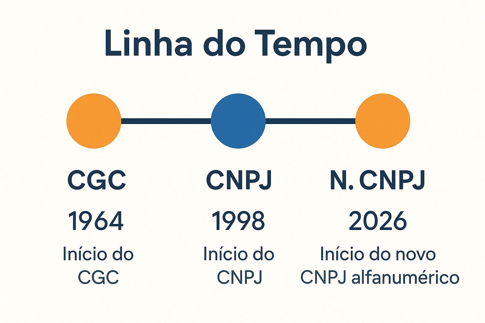
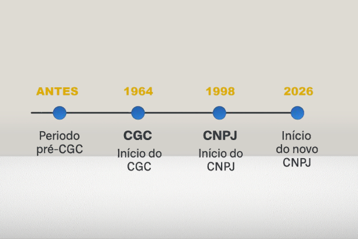
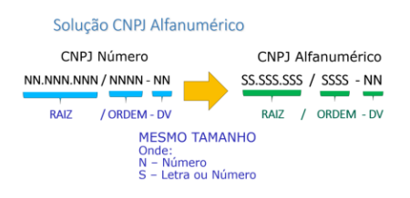
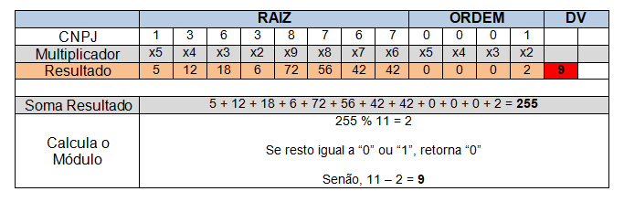
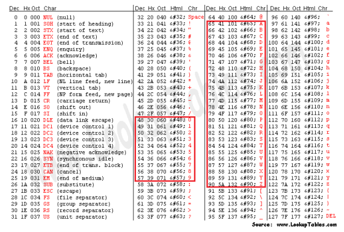
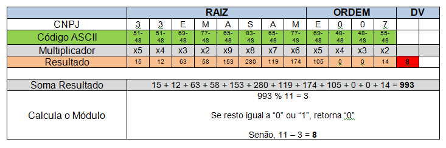
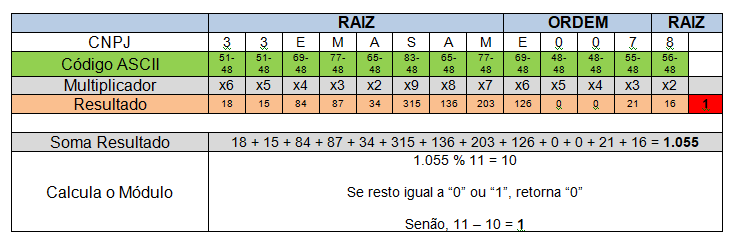
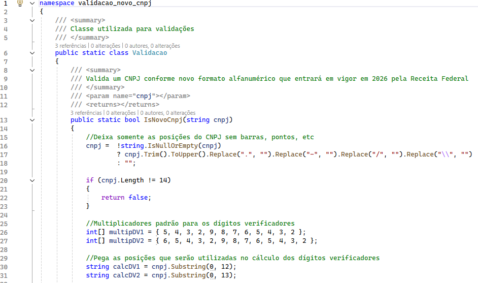
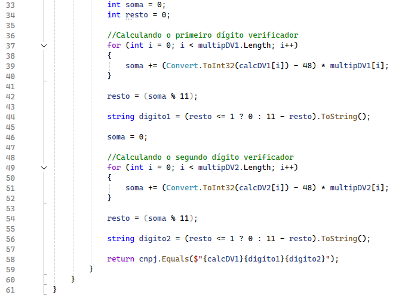
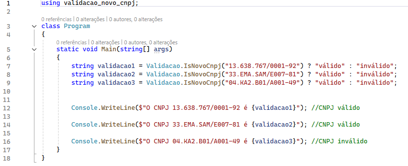

# Novo formato do CNPJ e validação em C#

No início de 2024, comecei a atuar num projeto onde era necessário realizar a integração de um sistema com a API de "[Consulta CNPJ](https://www.gov.br/conecta/catalogo/apis/consulta-cnpj)" da Receita Federal. Durante minhas pesquisas e desenvolvimento, deparei-me com alguns fatos curiosos, dentre eles um que me chamou a atenção: o número do Cadastro Nacional da Pessoa Jurídica passaria a aceitar caracteres alfanuméricos logo nos anos seguintes.

 

## :watch: Histórico

Até o início da década de 1960, o Brasil não possuía um cadastro nacional de pessoas jurídicas. Os registros não eram unificados. Com essa descentralização, empresas eram registradas de formas separadas nas diferentes esferas.

Em 1964, o Ministério da Fazenda instituiu, pelas Leis [4.503/1964](https://www.planalto.gov.br/ccivil_03/leis/1950-1969/L4503.htm) e [5.614/1970](https://www.planalto.gov.br/ccivil_03/leis/1970-1979/l5614.htm), o Cadastro Geral de Contribuintes - CGC, no qual o número de registro era composto por 8 dígitos. Foi a partir do CGC que o Serviço Federal de Processamento de Dados - SERPRO, conseguiu facilitar o processamento de dados fiscais.

Como forma de manter as informações dos contribuintes num sistema único, e também evoluir o CGC, foi criado em 1º de julho de 1998 (Instrução Normativa SRF nº 27/1998) o Cadastro Nacional da Pessoa Jurídica - CNPJ. Além dos 8 dígitos de inscrição que o CGC já tinha, o CNPJ passou a conter mais seis dígitos: sendo 4 números após a barra que identifica se a empresa é matriz ou filial, e os 2 últimos referentes aos dígitos verificadores que permitem informar se o CNPJ é válido.

Ainda em 2024, tomei conhecimento da *Nota Técnica conjunta COCAD/SUARA/RFB nº 49 de 14 de maio de 2024*. A nota alerta para a necessidade de adoção de uma nova estratégia para que seja possível suportar a quantidade de inscrições de acordo com o novo cenário, já que o formato atual do CNPJ (criado em 1998) permite cerca de 99,9 milhões de inscrições. O documento informa que esse limite está quase sendo atingido devido a alguns fatores:

- Crescimento da economia brasileira, sendo que só em 2023 chegou-se perto de 4 milhões de inscrições no CNPJ;
- Alta demanda de inscrições pelo MEI (Microempreendedores Individuais, criado em 2008);
- Criação das Empresas Simples de Crédito (ESCs), que permite a microempresas, empresas de pequeno porte e microempreendedores individuais realizar algumas operações de crédito com recursos próprios;
- Criação da Lei Federal da Rede Nacional para a Simplificação do Registro e da Legalização de Empresas e Negócios – REDESIM, em 2007, cujo objetivo é facilitar o processo de abertura e registro de empresas no país;
- Possibilidade de inclusão no CNPJ ampliada por novas legislações.

Além de informar sobre a escassez no número de inscrições, o SERPRO propôs no documento uma solução viável com o mínimo de impacto, a qual viabiliza a possibilidade de quase um trilhão de combinações no número raiz do CNPJ utilizando somente letras consoantes, conforme veremos a seguir.

 

## :pill: Mudanças

Com o objetivo de se obter o mínimo de impacto, foi mantido o número atual de posições, que é 14. As oito primeiras posições que representam a raiz agora aceitarão, além de números, letras. O mesmo ocorre para as quatro próximas posições que identificam a ordem do estabelecimento (se é matriz ou filial). Já as duas últimas posições, que representam os dígitos verificadores, permanecerão apenas como numéricos. Em resumo, somente os dígitos verificadores permanecerão como números. Uma forma de manter o mesmo esquema de validação do formato numérico utilizado até então.

Essa proposta permitiu manter a mesma regra para a validação do CNPJ. Basicamente, o cálculo é feito, inicialmente, multiplicando cada posição do CNPJ pelo seu multiplicador pré-estabelecido. Para calcular o primeiro dígito verificador, multiplicamos cada posição/valor pelo seu multiplicador, respectivamente, conforme a tabela abaixo. Feito isso, o valor de cada uma destas multiplicações deverá ser somado. Com a soma, precisaremos calcular o módulo, que nada mais é do que o resto da soma total dividido por 11. Tomemos por exemplo o CNPJ do LinkedIn Brasil, **13.638.767/0001-92**.

Observe que, para calcular o primeiro dígito, pegamos as 12 primeiras posições somente. Após obter o resultado do módulo, que no exemplo acima é 2, precisamos verificar se tal valor é menor ou igual a 1 (um), e caso positivo, o valor do dígito será 0 (zero). Do contrário, deveremos subtrair o resto de 11. No exemplo, o resultado foi 9. Já para calcular o segundo dígito verificador, a regra é a mesma, com a diferença de que acrescentamos também o primeiro dígito verificador para efetuar as somas:

É bom frisar que, apesar de um número de CNPJ ser válido, isso não significa que ele esteja cadastrado na base de dados da Receita Federal. Agora veremos como fica essa questão da validação para o CNPJ alfanumérico, e um exemplo prático feito utilizando a linguagem de programação C# da Microsoft.

 

## :zap: Validação do novo CNPJ em C#

Conforme informado na *Nota Técnica conjunta COCAD/SUARA/RFB nº 49 de 14 de maio de 2024*, o cálculo para a validação do CNPJ continua sendo pelo módulo 11. Porém, para que fossem incluídas as letras no número de inscrição do CNPJ, foi necessário alterar a maneira como se calcula o dígito verificador. A partir de agora, é necessário substituir os valores numéricos e alfanuméricos pelo valor decimal correspondente na tabela de código ASCII. De posse de tal valor, é necessário subtrair dele o valor 48. Por exemplo, na tabela abaixo temos a letra "E", cujo valor decimal é 69, logo 69 - 48 = 21, então E = 21 será o valor utilizado nas multiplicações.

No exemplo abaixo, utilizamos o CNPJ fictício **33.EMA.SAM/E007-81** para verificar se o mesmo é válido. Observe que existe um passo antes de partirmos para a multiplicação. Primeiramente, recuperamos os valores decimais correspondentes na tabela ASCII e subtraímos de cada um deles o valor 48. É com o resultado dessa subtração que efetuamos a multiplicação por cada um dos valores pré-definidos.

Note na forma como é feito o cálculo do segundo dígito verificador. No primeiro momento, recuperamos o respectivo valor decimal da letra ou número na tabela ASCII, e deste valor subtraímos o valor 48. Lembrando que é necessário incluir no cálculo o primeiro dígito verificador também. No segundo passo, efetuamos a multiplicação pelos valores pré-estabelecidos, depois efetuamos a soma. Por fim, entra o cálculo do módulo e a mesma regra que já existia anteriormente.

Partindo para a prática, criaremos um exemplo de uma classe em C# responsável por validar um CNPJ no padrão alfanumérico. Abaixo foi implementada uma classe estática juntamente com um método responsável pela validação. Na linha 16, "limpamos" a máscara do CNPJ caso a mesma tenha sido informada. Depois verificamos se o mesmo possui 14 posições na linha 20. Nas linhas 26 e 27 estamos criando os *arrays* com os valores pré-definidos responsáveis pela multiplicação de cada um dos dígitos do CNPJ. Já na linha 30, definimos as posições do CNPJ utilizadas no cálculo do primeiro dígito verificador, e, na linha 31, as posições utilizadas para calcular o segundo dígito verificador.

Seguindo o código-fonte, na linha 37 estamos "varrendo" o nosso *array* que possui os 12 valores pré-definidos para o cálculo do primeiro dígito, e, ao mesmo tempo, recuperando a respectiva posição no número do CNPJ. A linha 39 recupera o valor conforme a tabela ASCII e subtrai o valor 48, multiplicando logo em seguida pelo valor pré-definido. Tudo isso já armazenando na nossa variável *soma*. Na linha 42, recuperamos o resto da divisão da soma total por 11, e na linha 44, definimos qual é o primeiro dígito de fato. Seguindo pela linha 48, temos os mesmos procedimentos, mas agora para o segundo dígito verificador. Por fim, na linha 58, retornamos verdadeiro caso os dígitos calculados coincidam com os do CNPJ informado.

Por fim, testamos a nossa classe de validação com alguns exemplos:

 

## :floppy_disk: Instalação

`git clone https://github.com/emanuelsampaio/validacao-novo-cnpj`

 

## :mortar_board: Referências

*Nota Técnica Conjunta COCAD/SUARA/RFB n° 49/2024:* <https://www.seprorgs.org.br/admin/assets/upload/noticias_anexo/6039179747.pdf>

*Algoritmo para Validação do CNPJ:* <https://www.macoratti.net/alg_cnpj.htm>

*Criando o Projeto C# e as classes para validação:* <https://www.macoratti.net/11/09/c_val1.htm>

*Como validar o novo formato do CNPJ do Brasil:* <https://welyab.dev/2024/06/29/como-validar-o-novo-formato-do-cnpj-do-brasil>

---
##### Autor: <http://www.emanuelsampaio.com.br>
